## slice及其衍生

Go的数组和早期的C/Rust一样，大小都是编译期确定的，即a := [n]int是不可行的，**数组长度必须为常量**。此外，数组长度是数组类型的一部分，不同于Java等语言，数组类型仅仅是元素类型[]，**Go的数组类型 = 元素类型[] + 数组长度**。

也正因为此，Go的数组类型不常用，我们常用的是切片(Slice)，或者叫动态数组，或者说是Java的ArrayList类型，它会动态改变大小。不同于数组，**Slice的类型 = 元素类型[]**，这里不包含长度。

Slice的创建，增长等源码均在runtime/slice.go中实现，感兴趣可以看看，平时我们说一个变量是Slice类型，指的是它是一个**SliceHeader类型**。一个SliceHeader包含三个字段，分别是指向底层元素数组的指针，长度和容量。

``` go
type SliceHeader struct {
	Data uintptr
	Len  int
	Cap  int
}
```

容量始终大于等于长度，通过内置函数len()和cap()我们可以获取一个Slice的长度和容量。Slice的一些基本操作，创建，切分我们就不说了。

如果函数传参传递一个数组，则会涉及到调用参数和函数参数的复制，即数组会被复制一份。而如果我们**传参传的是Slice，则复制的是SliceHeader，这仅仅涉及到三个基本类型的复制**，相对开销会小很多。所以在被调函数中我们可以访问到Slice的底层数组并进行修改。

这里说一下Slice的遍历，主要针对一些可能存在的坑进行叙述，首先是：

``` go
for idx, val := range slice {
		// xxx
}
```

这样的做法相当常见，其中idx是切片下表，val是切片元素。但是要注意，val在所有循环中一直是一个不变的变量，循环期间会不断获取val的地址并重写这个地址上的值为slice[idx]的值，所以**val每次会被复制，且地址不变**。如果不想要复制切片元素产生的性能开销，则可以使用slice[idx]访问到底层数组上的元素，并且可以进行修改。

此外再来讨论关于内存泄露的一些点，如果引用了一个大切片的部分，那么相当于引用了整个切片，这就会导致大量内存得不到及时回收；可以考虑使用复制部分切片实现值传递，而非引用来切断引用关系。

切片内如果保存指针类型，也会有类似的情况，删除元素会因为底层数组收缩不及时，而继续持有引用，可以通过置为nil来实现。

最后，可以手动更改SliceHeader来实现强制类型转换，这里一般改的是底层数组指针的值。

### 字符串

字符串有些类似切片，我们先来看看StringHeader结构：

``` go
type StringHeader struct {
	Data uintptr
	Len  int
}
```

可以看到，它就一个底层数组指针和长度组成，所以**字符串天然不可修改**，每次赋值和更改操作均会创建新的字符串。

字符串底层是[]byte，所以可以直接通过str[idx]进行访问，此外，也可以强制类型转换成[]byte，如果通过for range遍历，则会得到码点，此时便利则变成了一个[]rune类型的数组的遍历，rune本质是一个int32类型。

字符串支持Slice的切片操作，此时会生成新的字符串并拷贝数据。

## unsafe

Go保留了指针，但是却给予其一定的限制。所以有时候我们想像C语言那样实现对内存地址的完全访问和控制，就需要unsafe来帮我们。

Unsafe包下最关键的两个类型则是Pointer和uintptr，这两个类型加上普通类型的指针类型，三者有着以下的关系：

可以看到，Pointer作为一个中介存在。它可以把任意类型的指针类型转换成可用于数学运算的纯数字类型uintptr，uintptr像是一个int型指针的别名，Pointer是*int的别名，对，是一个int指针的别名。

在这里我详细说一下uintptr：官方注释写到：uintptr类型的值大到足够容纳任何类型的指针的值，所以可以看成一个C语言中的void*类型，个人理解。但是无论什么类型的指针，本质都是一个地址，地址全部是数字类型的，或者说，整型的，所以uintptr代表的就是这个“整型”类型，也可以说“内存地址”类型，而内存地址是支持数学运算的。

现在来看看uintptr和Pointer的区别：

* uintptr能进行数学运算，即加减地址去访问新的地址，但是它只是一个数字，不会被GC检测到，所以uintptr类型的变量所保存的地址可能已经被回收了，即这里的引用关系无法被GC知晓
* Pointer是一个对象，它的变量持有的地址会被视为存在引用，即这个变量引用了这个地址，所以会被GC检测，而因为Go存在栈动态扩展，所以栈上对象可能会被移动，或者GC整理内存触发的地址变更，而Pointer会响应这些变更，也即Pointer保存的地址一定是合法的，可用的，uintptr则没有这个保证。

我们来看一个例子：

``` go
type Temp struct {
	a float64
	b int64
	c bool
}

func run() {
	t := Temp{
		a: 24.12,
		b: 12,
		c: true,
	}
	// 强制类型转换不是赋值，是原子性，啊也不对，强转本质只是解释方式改变，数据不变，所以一步到位
	pointerOfB := (*int64)(unsafe.Pointer(uintptr(unsafe.Pointer(&t)) + 8))
	*pointerOfB += 6
	fmt.Println(t)
	// 这里因为存在中间变量赋值，假如，就在赋值刚刚完成之后发生了GC导致t地址变化，那么tempAddress是不会被更新的
	tempAddress := uintptr(unsafe.Pointer(&t)) + 8
	// 所以会导致这里出现非法地址访问
	// https://stackoverflow.com/questions/42067478/when-is-it-safe-in-go-to-reference-an-object-only-through-a-uintptr有解释
	badPointerOfB := (*int64)(unsafe.Pointer(tempAddress))
	*badPointerOfB += 6
	fmt.Println(t)
}
```

在理解这个例子之前，我们先看看Go结构体布局。Go称为互联网时代的C语言，很大部分原因是因为它和C很像，结构体布局亦是如此：



这里说一下空结构体，空结构体本身不占内存，所以在最前面时不占空间，但是如果空结构体在结构体最后，同时此时没有触发内存对齐，就会**触发编译器的强制对齐，目的是防止访问到下一个内存区域**。

所以结构体对象可以通过**合理排列字段，来实现更好地内存利用**。


我们回到上面的例子。两个更新Temp.b的方法都可以达到目的，但是Goland会给予第二种方式一个提示，大意：此方法可能造成非法地址访问。那为什么会这样呢？

首先我们通过Pointer得到t的地址，然后转换成uintptr进行四则运算，然后转换成Pointer，再转换成类型指针，解引用访问。仔细对比，无非是第二种方式多了一个临时变量去记录Temp的b字段的实际地址，那为什么这里不可以呢？因为可能在**赋值给tempAddress时发生了GC或者栈满了**，总之**Temp对象被移动了**，那此时tempAddress保存的就是一个非法的值了。

其实最关键的是tempAddress是一个uintptr类型的变量，它不会响应对象被移动，所以它仅仅保存一直值，当对象被移动时它不会得到任何通知去更新，而写在uintptr(Pointer)的值会永远因为Pointer去响应更新，此外强制类型转换仅仅是改变了解释这个内存地址上面的变量的方式，不存在被中断这一说，所以这是一个“连续性可响应”的操作。


其他操作，比如unsafe.Alignof()返回对象的对齐，如果对象是结构体，则是所有字段对齐的最大值，以此递归，如果是基本类型，就是本身大小；unsafe.Sizeof()返回对象内存大小，包含对齐大小；还有unsafe.Offsetof()返回字段距离结构体起始位置的大小，单位，字节。

## 并发

并发作为一个经久不衰的话题，我们自然不会落下，但是在叙述Go的并发之前，我想先说一下Go的内存模型，Go的内存模型无外乎大多数编程语言的设计，说到内存模型，一定会涉及变量可见性，因为**内存模型这个概念，就是为了对多个线程对于同一个变量的读写可见性描述**。而变量可见性的判断依据有一个很重要的**happen-before原则(以下简称h-b)**。

### happen-before

h-b更像是一个判断依据，通过它，我们可以**判断两个不同Go程的读写操作是否满足预期结果**。怎么理解这句话呢？首先，在多个Go程中，因为指令排序和Go程调度，又或者是L1缓存的存在，导致对于同一变量的读，不一定会读到另一个Go程写入的值，即**共享变量的更新可见性无法被保证**。而**满足h-b原则的两个读写操作，先写的更新一定会被后读的读所捕获，不满足h-b的读写则没有这样的结论**。

说白了h-b可以作为判断后读是否可以读到先写的值得一个依据，**它是判断这一结果的原则，而不是保证这一结果的原则**。

那为什么会引入h-b原则呢？因为在同一个Go程中，即使存在指令重排序，代码的执行结果也一定符合书写顺序，这是编译器可以保证的；但是在多个Go程中，则没有这种保证，对于Go程A，它看到的Go程B对于某一变量的写可能晚于自己的读，即使从源码来看这件事是不可能的。所以**我们急需一个原则去告诉我们，这个读操作到底能不能读到另一个Go程的更新？**这个原则就是h-b。对于两个事件r-w，如果r h-b于w，或者w h-b于r(**r happen-after w**)，则称它们之间存在顺序关系，但是**如果r 既不h-b于w，w也不h-b于r，那么我们称r-w两个事件是happen-concurrently，即并发的**。

如果上述官方术语让读者读不懂的话，我用一个简单的符号表示h-b，即'<'(小于号)。**a h-b b写成a < b，说明a事件先于b事件发生**。如果a和b不存在小于关系，我们就得不到这个结论(废话)。而**如果a >= b且b >= a，则a和b是并发的**。

编程语言一般都存在一些天然的h-b关系，同时还存在一些可以人为实现的h-b关系，或者可以由上述两者推导出来的h-b关系，**除此之外，都是无法确定h-b关系的**。

让我们来看看[官方文档](https://go.dev/ref/mem)对于这些的叙述：

* 在单线程中，对于一个变量的读写顺序就是书写顺序。
* 在多Go程中，只有满足如下准则，读操作才能读到写更新：
  * 读**从不**会h-b于写。
  * 在写读之间没有第二个写h-b在第一个写之后，且h-b在读之前。
* 再来一个更加犀利的准则，确保读可以读到写更新：
  * 写h-b于读。
  * 任何其他的写一定h-b于这个写或者被h-b于读(在读之后)。
* 如果没有这些准则，就需要手动添加同步原语以保证达到想要的效果。
* 此外，变量创建时的赋初值属于对变量的写操作。

那么在Go中存在哪些同步原语可以确保h-b呢？我们不妨来数数：

* init函数调用h-b于任何一个此go文件中的函数调用，h-a于所有它所引用的go文件的init函数调用。
* Go程的创建h-b于此Go程中的任何部分。
* Go程的销毁h-a于它的任何部分，但是h-c于它所在的函数任何部分；即Go程里新开的Go程退出时间我们无法确定，和它周围的代码是h-c关系。
* 对于一个无缓冲的chan，接收操作h-b于发送操作**结束**；发送操作h-b于接收操作**结束**。即接收/发送**开始**h-b于发送/接收的**结束**。
* 上述关于无缓冲chan的描述，换成h-a更好，即接收操作的完成一定h-a于发送操作开始，反之亦然，方便理解。
* 此外，close一个chan，会触发零值返回，所以close一个chan就像发送了一个零值一样，虽然有一些不同，但是在同步中的作用是类似的。
* 对于一个缓冲的chan，第K的接收操作先于第K+capacity个发送操作完成。
* Mutex锁实现的同步原语，无论是锁还是读写锁都存在m<n，有第m次释放锁先于n次加锁完成(即加锁函数返回)。
* sync.Once也可以实现，Once参数的调用(它的参数是个函数)早于所有对于Once.do()的调用完成(即Once.do()返回)。

关于channel，看一张图：


现在来看看Go可能的同步使用方法。

最常用的就是chan。chan的灵活使用和Go强调的基于管道通信，CSP技术有着莫大的关系。除了简单的通过chan来实现happen-before以此来控制多Go程执行顺序之外，还有以下用法：

* 设置带缓冲的chan，实现最大并发控制。
* 作为信号通知，控制其他Go程的退出。
* 作为timer返回值使用，实现定时器功能。

然后就是Mutex/RWMutex，类似Java的锁和读写锁。就是普通的可重入锁，底层实现包含一个虚拟队列和资源值，通过CAS设置，失败了自旋/入队。

官网还有一个演示chan的用法，比如作为计时器，作为多选择并发请求响应选取。

``` go
func main() {
	timeout := make(chan struct{}, 1)
	go func() {
		time.Sleep(3 * time.Second)
		timeout <- struct{}{}
	}()
	<-timeout
	fmt.Println("run")
}
```

需要注意，当涉及到信号控制，或者未来的数据到达时，需要给chan设置一个缓冲区大小，这样可以阻塞接收者而不会阻塞调用者；想象一下，如果接收者是一个耗时任务，当超时到了，发送超时信号的发送者反而会被阻塞，这肯定是我们不想看到的，尤其是有多个接收者时，另一个接收者反而被接收者阻塞了，所以**我们不应该阻塞发送者，就应该设置缓冲区**。

关于Go并发我们暂时介绍到这里，至于原子类型，Mutex，channel底层实现这些，留在后期底层剖析再去处理，这里仅仅作为一个引子引出了这些东西。
