## slice及其衍生

Go的数组和早期的C/Rust一样，大小都是编译期确定的，即a := [n]int是不可行的，**数组长度必须为常量**。此外，数组长度是数组类型的一部分，不同于Java等语言，数组类型仅仅是元素类型[]，**Go的数组类型 = 元素类型[] + 数组长度**。

也正因为此，Go的数组类型不常用，我们常用的是切片(Slice)，或者叫动态数组，或者说是Java的ArrayList类型，它会动态改变大小。不同于数组，**Slice的类型 = 元素类型[]**，这里不包含长度。

Slice的创建，增长等源码均在runtime/slice.go中实现，感兴趣可以看看，平时我们说一个变量是Slice类型，指的是它是一个**SliceHeader类型**。一个SliceHeader包含三个字段，分别是指向底层元素数组的指针，长度和容量。

```go
type SliceHeader struct {
    Data uintptr
    Len  int
    Cap  int
}
```

容量始终大于等于长度，通过内置函数len()和cap()我们可以获取一个Slice的长度和容量。Slice的一些基本操作，创建，切分我们就不说了。

如果函数传参传递一个数组，则会涉及到调用参数和函数参数的复制，即数组会被复制一份。而如果我们**传参传的是Slice，则复制的是SliceHeader，这仅仅涉及到三个基本类型的复制**，相对开销会小很多。所以在被调函数中我们可以访问到Slice的底层数组并进行修改。

这里说一下Slice的遍历，主要针对一些可能存在的坑进行叙述，首先是：

```go
for idx, val := range slice {
        // xxx
}
```

这样的做法相当常见，其中idx是切片下表，val是切片元素。但是要注意，val在所有循环中一直是一个不变的变量，循环期间会不断获取val的地址并重写这个地址上的值为slice[idx]的值，所以**val每次会被复制，且地址不变**。如果不想要复制切片元素产生的性能开销，则可以使用slice[idx]访问到底层数组上的元素，并且可以进行修改。

此外再来讨论关于内存泄露的一些点，如果引用了一个大切片的部分，那么相当于引用了整个切片，这就会导致大量内存得不到及时回收；可以考虑使用复制部分切片实现值传递，而非引用来切断引用关系。

切片内如果保存指针类型，也会有类似的情况，删除元素会因为底层数组收缩不及时，而继续持有引用，可以通过置为nil来实现。

最后，可以手动更改SliceHeader来实现强制类型转换，这里一般改的是底层数组指针的值。

### 字符串

字符串有些类似切片，我们先来看看StringHeader结构：

```go
type StringHeader struct {
    Data uintptr
    Len  int
}
```

可以看到，它就一个底层数组指针和长度组成，所以**字符串天然不可修改**，每次赋值和更改操作均会创建新的字符串。

字符串底层是[]byte，所以可以直接通过str[idx]进行访问，此外，也可以强制类型转换成[]byte，如果通过for range遍历，则会得到码点，此时便利则变成了一个[]rune类型的数组的遍历，rune本质是一个int32类型。

字符串支持Slice的切片操作，此时会生成新的字符串并拷贝数据。

## unsafe

Go保留了指针，但是却给予其一定的限制。所以有时候我们想像C语言那样实现对内存地址的完全访问和控制，就需要unsafe来帮我们。

Unsafe包下最关键的两个类型则是Pointer和uintptr，这两个类型加上普通类型的指针类型，三者有着以下的关系：

可以看到，Pointer作为一个中介存在。它可以把任意类型的指针类型转换成可用于数学运算的纯数字类型uintptr，uintptr像是一个int型指针的别名，Pointer是*int的别名，对，是一个int指针的别名。

在这里我详细说一下uintptr：官方注释写到：uintptr类型的值大到足够容纳任何类型的指针的值，所以可以看成一个C语言中的void*类型，个人理解。但是无论什么类型的指针，本质都是一个地址，地址全部是数字类型的，或者说，整型的，所以uintptr代表的就是这个“整型”类型，也可以说“内存地址”类型，而内存地址是支持数学运算的。

现在来看看uintptr和Pointer的区别：

* uintptr能进行数学运算，即加减地址去访问新的地址，但是它只是一个数字，不会被GC检测到，所以uintptr类型的变量所保存的地址可能已经被回收了，即这里的引用关系无法被GC知晓
* Pointer是一个对象，它的变量持有的地址会被视为存在引用，即这个变量引用了这个地址，所以会被GC检测，而因为Go存在栈动态扩展，所以栈上对象可能会被移动，或者GC整理内存触发的地址变更，而Pointer会响应这些变更，也即Pointer保存的地址一定是合法的，可用的，uintptr则没有这个保证。

我们来看一个例子：

```go
type Temp struct {
    a float64
    b int64
    c bool
}

func run() {
    t := Temp{
        a: 24.12,
        b: 12,
        c: true,
    }
    // 强制类型转换不是赋值，是原子性，啊也不对，强转本质只是解释方式改变，数据不变，所以一步到位
    pointerOfB := (*int64)(unsafe.Pointer(uintptr(unsafe.Pointer(&t)) + 8))
    *pointerOfB += 6
    fmt.Println(t)
    // 这里因为存在中间变量赋值，假如，就在赋值刚刚完成之后发生了GC导致t地址变化，那么tempAddress是不会被更新的
    tempAddress := uintptr(unsafe.Pointer(&t)) + 8
    // 所以会导致这里出现非法地址访问
    // https://stackoverflow.com/questions/42067478/when-is-it-safe-in-go-to-reference-an-object-only-through-a-uintptr有解释
    badPointerOfB := (*int64)(unsafe.Pointer(tempAddress))
    *badPointerOfB += 6
    fmt.Println(t)
}
```

在理解这个例子之前，我们先看看Go结构体布局。Go称为互联网时代的C语言，很大部分原因是因为它和C很像，结构体布局亦是如此：


这里说一下空结构体，空结构体本身不占内存，所以在最前面时不占空间，但是如果空结构体在结构体最后，同时此时没有触发内存对齐，就会**触发编译器的强制对齐，目的是防止访问到下一个内存区域**。

所以结构体对象可以通过**合理排列字段，来实现更好地内存利用**。

我们回到上面的例子。两个更新Temp.b的方法都可以达到目的，但是Goland会给予第二种方式一个提示，大意：此方法可能造成非法地址访问。那为什么会这样呢？

首先我们通过Pointer得到t的地址，然后转换成uintptr进行四则运算，然后转换成Pointer，再转换成类型指针，解引用访问。仔细对比，无非是第二种方式多了一个临时变量去记录Temp的b字段的实际地址，那为什么这里不可以呢？因为可能在**赋值给tempAddress时发生了GC或者栈满了**，总之**Temp对象被移动了**，那此时tempAddress保存的就是一个非法的值了。

其实最关键的是tempAddress是一个uintptr类型的变量，它不会响应对象被移动，所以它仅仅保存一直值，当对象被移动时它不会得到任何通知去更新，而写在uintptr(Pointer)的值会永远因为Pointer去响应更新，此外强制类型转换仅仅是改变了解释这个内存地址上面的变量的方式，不存在被中断这一说，所以这是一个“连续性可响应”的操作。

其他操作，比如unsafe.Alignof()返回对象的对齐，如果对象是结构体，则是所有字段对齐的最大值，以此递归，如果是基本类型，就是本身大小；unsafe.Sizeof()返回对象内存大小，包含对齐大小；还有unsafe.Offsetof()返回字段距离结构体起始位置的大小，单位，字节。

## 并发

并发作为一个经久不衰的话题，我们自然不会落下，但是在叙述Go的并发之前，我想先说一下Go的内存模型，Go的内存模型无外乎大多数编程语言的设计，说到内存模型，一定会涉及变量可见性，因为**内存模型这个概念，就是为了对多个线程对于同一个变量的读写可见性描述**。而变量可见性的判断依据有一个很重要的**happen-before原则(以下简称h-b)**。

### happen-before

h-b更像是一个判断依据，通过它，我们可以**判断两个不同Go程的读写操作是否满足预期结果**。怎么理解这句话呢？首先，在多个Go程中，因为指令排序和Go程调度，又或者是L1缓存的存在，导致对于同一变量的读，不一定会读到另一个Go程写入的值，即**共享变量的更新可见性无法被保证**。而**满足h-b原则的两个读写操作，先写的更新一定会被后读的读所捕获，不满足h-b的读写则没有这样的结论**。

说白了h-b可以作为判断后读是否可以读到先写的值得一个依据，**它是判断这一结果的原则，而不是保证这一结果的原则**。

那为什么会引入h-b原则呢？因为在同一个Go程中，即使存在指令重排序，代码的执行结果也一定符合书写顺序，这是编译器可以保证的；但是在多个Go程中，则没有这种保证，对于Go程A，它看到的Go程B对于某一变量的写可能晚于自己的读，即使从源码来看这件事是不可能的。所以**我们急需一个原则去告诉我们，这个读操作到底能不能读到另一个Go程的更新？**这个原则就是h-b。对于两个事件r-w，如果r h-b于w，或者w h-b于r(**r happen-after w**)，则称它们之间存在顺序关系，但是**如果r 既不h-b于w，w也不h-b于r，那么我们称r-w两个事件是happen-concurrently，即并发的**。

如果上述官方术语让读者读不懂的话，我用一个简单的符号表示h-b，即'<'(小于号)。**a h-b b写成a < b，说明a事件先于b事件发生**。如果a和b不存在小于关系，我们就得不到这个结论(废话)。而**如果a >= b且b >= a，则a和b是并发的**。

编程语言一般都存在一些天然的h-b关系，同时还存在一些可以人为实现的h-b关系，或者可以由上述两者推导出来的h-b关系，**除此之外，都是无法确定h-b关系的**。

让我们来看看[官方文档](https://go.dev/ref/mem)对于这些的叙述：

* 在单线程中，对于一个变量的读写顺序就是书写顺序。
* 在多Go程中，只有满足如下准则，读操作才能读到写更新：
  * 读**从不**会h-b于写。
  * 在写读之间没有第二个写h-b在第一个写之后，且h-b在读之前。
* 再来一个更加犀利的准则，确保读可以读到写更新：
  * 写h-b于读。
  * 任何其他的写一定h-b于这个写或者被h-b于读(在读之后)。
* 如果没有这些准则，就需要手动添加同步原语以保证达到想要的效果。
* 此外，变量创建时的赋初值属于对变量的写操作。

那么在Go中存在哪些同步原语可以确保h-b呢？我们不妨来数数：

* init函数调用h-b于任何一个此go文件中的函数调用，h-a于所有它所引用的go文件的init函数调用。
* Go程的创建h-b于此Go程中的任何部分。
* Go程的销毁h-a于它的任何部分，但是h-c于它所在的函数任何部分；即Go程里新开的Go程退出时间我们无法确定，和它周围的代码是h-c关系。
* 对于一个无缓冲的chan，接收操作h-b于发送操作**结束**；发送操作h-b于接收操作**结束**。即接收/发送**开始**h-b于发送/接收的**结束**。
* 上述关于无缓冲chan的描述，换成h-a更好，即接收操作的完成一定h-a于发送操作开始，反之亦然，方便理解。
* 此外，close一个chan，会触发零值返回，所以close一个chan就像发送了一个零值一样，虽然有一些不同，但是在同步中的作用是类似的。
* 对于一个缓冲的chan，第K的接收操作先于第K+capacity个发送操作完成。
* Mutex锁实现的同步原语，无论是锁还是读写锁都存在m<n，有第m次释放锁先于n次加锁完成(即加锁函数返回)。
* sync.Once也可以实现，Once参数的调用(它的参数是个函数)早于所有对于Once.do()的调用完成(即Once.do()返回)。

关于channel，看一张图：


现在来看看Go可能的同步使用方法。

最常用的就是chan。chan的灵活使用和Go强调的基于管道通信，CSP技术有着莫大的关系。除了简单的通过chan来实现happen-before以此来控制多Go程执行顺序之外，还有以下用法：

* 设置带缓冲的chan，实现最大并发控制。
* 作为信号通知，控制其他Go程的退出。
* 作为timer返回值使用，实现定时器功能。

然后就是Mutex/RWMutex，类似Java的锁和读写锁。就是普通的可重入锁，底层实现包含一个虚拟队列和资源值，通过CAS设置，失败了自旋/入队。

官网还有一个演示chan的用法，比如作为计时器，作为多选择并发请求响应选取。

```go
func main() {
    timeout := make(chan struct{}, 1)
    go func() {
        time.Sleep(3 * time.Second)
        timeout <- struct{}{}
    }()
    <-timeout
    fmt.Println("run")
}
```

需要注意，当涉及到信号控制，或者未来的数据到达时，需要给chan设置一个缓冲区大小，这样可以阻塞接收者而不会阻塞调用者；想象一下，如果接收者是一个耗时任务，当超时到了，发送超时信号的发送者反而会被阻塞，这肯定是我们不想看到的，尤其是有多个接收者时，另一个接收者反而被接收者阻塞了，所以**我们不应该阻塞发送者，就应该设置缓冲区**。

关于Go并发我们暂时介绍到这里，至于原子类型，Mutex，channel底层实现这些，留在后期底层剖析再去处理，这里仅仅作为一个引子引出了这些东西。

## CGO

CGO，不是CSGO哈！指的是通过Go去调用C代码，或者由Go来实现一些功能并导出为C函数，供C调用，CGO的演示用例参见[cgo](../cgo)代码包。

现在来说说一些需要注意的事项，C的基本类型和Go的基本类型一一对应是没问题的，但是有一个类型需要特别注意，就是指针类型，C的指针类型可以直接进行数学运算，Go的指针类型更像是一个对象，所以C的指针类型=*T+unsafe.Pointer+uintptr这三个结合体。当我们需要**调用一个接收指针类型的C函数时，传递一个unsafe.Pointer类型**；因为unsafe.Pointer相当于C的 *void，即void指针。 

此外，Go是带有GC和栈动态增长的语言，所以对象地址会变化。这是需要尤为注意的一点！CGO为了保证引用Go对象的C函数访问的内存地址一直有效，会**强制保证C函数执行期间，引用的地址的对象不会被移动**，但是坏处就是如果C函数涉及到耗时操作，会阻碍GC运行，拖垮Go程序性能和吞吐量！解决的方式有很多，包括模拟指针传递，或者暴力一点，直接用值复制。但是都不如直接指针效率高。

此外，**传递给C函数的Pointer所指向的内存区域，不能包含其他的Go指针**，因为CGO仅仅可以确保这个Pointer指向的Go内存不被移动，但是这块内存的子域(就结构体字段或者切片元素)引用的Go内存区域不属于强制管理范畴。

同理，**作为C头文件实现者的Go函数不能返回Pointer**，因为返回值不属于CGO强制管理范畴。

同时**传递给C的Pointer同样具有被更新性**，即如果通过临时变量传递Pointer，则可能出现上面说的那种更新不及时的现象。

来总结下：

- Go调用C传参
  
  - 传递指针使用Pointer。
  
  - 不能出现嵌套指针，因为CGO只能保证最外层指针指向内存的不移动性。
  
  - 长时间持有指针的C函数可能造成Go程阻塞。
  
  - 如果想获取Go对象同时不借助CGO强制固定地址，可以使用对象ID等方法记录一个对象引用，同时把操作对象的实际代码交由Go函数完成，即C函数只是一个“指挥家”，Go接受C函数的“发号施令”。

- Go调用C返回值
  
  - C函数返回值可以任意使用，因为内存地址不变，借此可以突破一些Go的限制；但是C返回了内存地址**必须记得手动释放内存**。

- C调用Go传参
  
  - 暂无

- C调用Go返回值
  
  - Go函数的返回的地址不应该被C使用，因为CGO无法通过返回值固定被C函数使用的内存。

[参考](https://segmentfault.com/a/1190000013590585)

## 汇编

Go的汇编不是C的汇编，C语言的汇编是强绑定于机器和编译器的。Go的汇编是**基于Plan 9汇编改编的，且抽象了部分指令和架构，使之更加通用的Go汇编**。但是我们可以在Go汇编中看到熟悉的影子。

Plan 9汇编不是我们重点关注的内容，感兴趣的读者可以去看看。我们这里更多是基于X64架构讲解Go的汇编。为什么是X64呢？因为服务器基本是X64架构的。

在正式讲解之前，我希望读者拥有部分计算机组成原理的基础。比如了解X64架构的基本执行原理。我们先来看一张图：


X64是典型的callee saved模式，即被调用者负责保存调用者的寄存器，调用者在自己的栈帧里设置参数和返回地址(CALL指令下条指令的地址，不是返回值地址)。返回值一般通过RAX寄存器保存。

当发生函数调用时：

* 设置函数传参。
* 返回地址压入栈。
* 移交执行权至被调用者。
* 被调用者设置rbp为当前rsp值，即rbp指向新的栈帧的底部。
* 新的rsp随着被调用者执行而变化(其实这里就不管它了)。
* 按需申请空间，存放局部变量等，执行。

当函数调用返回值：

* 通过rbp寄存器找到返回值，保存返回地址。
* 在rbp的位置弹出返回地址(所以这里看到，rbp是为了获取调用者栈帧的栈顶而设置的，然后就可以获取到返回地址)。
* 这是rsp为弹出后的位置(完成被调用者栈帧的释放)。
* 跳转到返回地址继续执行，完成执行权回转。

回顾完X64的基本执行过程，我们来看看Golang的设计，Golang的汇编，为了实现更好的跨平台和统一书写，抽象出了四个寄存器，除了这四个寄存器，**其他架构本身的寄存器依旧是可用的**(比如R8X~R15X等，RAX，RBP，RSP等)。只是这四个寄存器可以更好地实现通用设计。

* PC：对应IP寄存器，保存下一条指令的位置。
* SB：作为全局变量基指针，用来定位全局变量和函数；可以试着把内存理解成一个大号的数组，全局变量和函数的地址都是相对于SB的偏移量，确定了SB的值，加上偏移量，即可在内存中定位到全局变量和函数。
* SP：这是一个伪SP寄存器，因为我们都知道，真的SP(在X64就是RSP)寄存器是栈顶指针；这里的伪SP起到栈底指针的作用，指向当前栈帧的起始位置，用来定位局部变量。
* FP：这依旧是一个伪寄存器，指向调用者的栈帧区域，用来方便被调用者查找参数和写入返回值。

除去这四个伪寄存器，Golang的其他栈帧结构和X64是很像的：


区分伪SP和真SP的方法很简单：就是真SP没有任何前缀，伪SP寄存器有一个符号作为前缀。

对于一个函数，我们可以通过汇编定义，然后在普通Go文件调用，既不需要导出，也不需要其他什么操作，Go编译器会帮我们完成这一切。这里需要注意一点，就是汇编不可以和CGO一起使用，否则会出现符号解析错误，因为CGO会把.s文件当成C的汇编来处理。

对于一个全局变量，我们也可以指定变量名，变量大小，然后初始化它，但是没法指明它的类型，类型不存在于Golang汇编中。

对于局部变量，则是使用SP来定位设置，但是需要在定义函数时提前指定大小，这里的大小就是全部局部变量的大小(暂时不考虑变量内存复用)。

对于函数**传参，返回值，按照返回值 => 参数；后 => 前压入栈中**。结构体亦是如此；在对结构体完成对齐之后，**结构体成员按照从前向后的顺序入栈**，但是结构体和参数，或者结构体和其他返回值之间依旧是后 => 前的顺序。

Golang的汇编属于自己独有的一套，语法标准啥的和AT&T或者Intel的都有不同。我们这里不会深究，仅仅可以做到阅读汇编代码。如果你想书写汇编代码，或者实现更加复杂的功能，可以阅读Plan 9语法以及一些更加进阶的书籍。

在了解了Golang汇编的内存布局和简单的架构之后，本章目的就完成了！毕竟先读懂，再去写，利用汇编压榨CPU，把性能发挥到极致；或者利用汇编实现一些越权操作，定制化属于我们自己的功能。

## Golang接口

Golang的接口无非就是带方法的iface和没有方法的空接口eface：

```go
type eface struct {
    _type *_type         // 类型指针
    data  unsafe.Pointer // 数据指针
}


type iface struct {
    tab  *itab          // (类型+方法集)指针
    data unsafe.Pointer // 数据指针
}
```

然后来详细看一下它们的结构：

```go
type _type struct {
    size       uintptr                                   // 此接口类型背后的实际类型占用空间大小
    ptrdata    uintptr                                   // 用不到，不理解
    hash       uint32                                    // 实际类型hash码，作为类型唯一ID用的，用于比较类型是否相同，下面还有一个比较对象的
    tflag      uint8                                     // 用不到
    align      uint8                                     // 内存偏移量
    fieldAlign uint8                                     // 字段偏移量，可能是结构体字段用的
    kind       uint8                                     // Go的内置类型，我猜的
    equal      func(unsafe.Pointer, unsafe.Pointer) bool // 用于比较此类型的两个对象是否相同
    gcdata     *byte                                     // GC用的
    str        int32                                     // 类型名称字符串在可执行文件中的偏移量
    ptrToThis  int32                                     // 此类型在可执行文件中的偏移量
}

type itab struct {
    inter *interfacetype // 记录iface的抽象结构，包含方法表等信息，这个接口变量的静态类型
    _type *_type         // 同上的结构，这个接口变量的实际类型
    hash  uint32         // _type.hash的拷贝，单纯方便使用，免得还要通过_type查hash，指出了实际类型的hash码
    _     [4]byte        // 保留
    fun   [1]uintptr     // 函数表指针，虽然数组长度为1，但是后面可以跟着好多个函数地址，这个值指向第一个函数的地址，有种数组指针的味道
}

type interfacetype struct {
    typ     _type     // 接口的变量的静态类型，也就是这个接口类型
    pkgpath name      // 接口的包路径
    mhdr    []imethod // 接口的方法表
}

type imethod struct {
    name int32 // 方法名称
    ityp int32 // 方法所属的接口的类型
}
```

然后通过一张图来理解：


Go判断一个类型T能否赋值给一个接口A的方法比较硬核：**遍历eface的mhdr，然后和类型T的所有的方法进行比对**，时间复杂度是O(m\*n)，但是Go进行了优化，使用字典序排序，以至于只有O(m+n)，如果全部匹配，则认为T类型实现了接口A。

这里解释一下为什么接收者为指针的类型T的实例无法赋值给接口A，以前总是背说Go可以自动解引用，但是无法自动取地址，其实不然。

首先明确一点，**Go调用方法类似调用一个第一个参数是类型实例或类型指针(取决于接收者类型)的普通函数**。Go都是值传递，如果使用对象值去调用接口的方法，会导致实例被复制，然后基于此新实例取地址去调用接口，倘若此时涉及到字段的更新，则无法响应原先的实例，这会造成程序bug。所以Go禁止此方法。而如果通过指针去调用接口方法，即使是值传递，传的也是指针，对实例的更新一定会响应回实例对象。

关于接口和对象之间的转换。

我们假设有这么一段代码：

- 新建类型T的实例obj；

- 强制把obj转为interface得到iobj；

- 通过iobj调用方法；

- 通过obj调用方法；

- 把iobj转换成obj0；

首先编译器在编译时，针对类型T，生成了它独有的_type结构，并保存在某个位置(我他妈也不知道在哪里)，然后

- 调用runtime.newobject(_type)为T的新实例分配空间，并在栈上设置变量obj，注意哈，实例对象是在栈上的，当然可能会因为逃逸分析放在堆上，那此时对变量的访问就会变成通过指针对于堆的访问了。

- 初始化obj；

- 调用runtime.convT2I方法，入参分别是T经过检查之后针对接口A生成的的tab和obj的指针，因为这个函数只能接收数据指针，所以此时的指针就是栈上保存obj的地址；

- 把上述函数返回值作为iface结构体的字段，进行构造；

- 通过查找iobj的fun，找到对应方法，设置方法入参(推入栈中)，调用方法。

- 直接调用obj的方法；

- 通过iobj的hash与T的_type比较判断是否可以转换，如果可以，则创建T类型的变量obj0，然后使用iobj的数据指针指向的空间填充变量，实现复原。

涉及到的函数签名：

```go
func newobject(typ *_type) unsafe.Pointer

func convT2I(tab *itab, elem unsafe.Pointer) (i iface)

func convT2E(t *_type, elem unsafe.Pointer) (e eface)
```

对于eface的处理则会简单一些，因为不需要进行方法列表比对，查表，动态分发(只有被转换之后才能调用方法)等操作。每次转换简单对比一下hash码，然后新建变量，使用数据指针填充即可。简单描述一下就是：如果原本的变量是指针类型，那数据指针指向的就是指针保存的地址的地址，噼里啪啦一顿操作之后，新的变量的值等于数据指针指向地址的保存的值，此时新的变量成为了一个指向T类型的指针，这当然很简单啦！如果是普通类型，那就是一个T类型的变量，然后依旧使用数据指针指向的内存空间进行变量填充。

这里有一个小坑，接口类型只有两个字段全为nil时，接口才是nil的，啥意思呢？当你把值为nil的指针类型转换成接口时，转换后的接口变量不是nil，因为它的_type并不是nil，而是具体的指针类型。

什么类型断言啊，什么类型转换啊，什么接口转换啊，什么接收者类型是指针还是实例啊巴拉巴拉的，上面的一些话和图基本都覆盖了，接口的知识到此结束！

## 反射

本来Go的反射还能讲一些，但是现在把接口理完了之后，似乎一切都变得那么简单。

反射核心就是：

```go
func TypeOf(i interface{}) Type

func ValueOf(i interface{}) Value
```

它们负责把interface{}转换成反射对象，当然了，反射对象也可以转换成interface{}，其实这就是反射三大定律的两个。

- 可以从interface{}得到反射对象

- 可以从反射对象得到interface{}

- 想要修改反射对象，它的值必须是可设置的

我们可以看到，两个核心方法的入参都是interface{}类型，当我们调用时，编译器会自动做类型转换，所以我们有了下面的对应关系：


这里interface{}会被处理得到emptyInterface的结构体，这个结构体和上面的iface一模一样，那到这里，一切就清晰了。

emptyInterface里面的数据指针则是Value的值来源，\*rtype则是Type的值来源，此时我们清楚地得到了类型结构体和值指针，想要获取一些就是直接读取和解析的事儿。

以结构体为例，结构体方法是有序存放在结构体类型后面的，偏移量亦是固定的，想要访问方法列表，需要把emptyInterface转换成structTypeUncommon，然后读取相关的方法偏移量找到方法列表，以及方法个数等。

对于通过反射设置值，需要注意，如果是普通的变量，则可能会因为触发了值复制，因为无法设置到原对象上，此时简单使用指针传参即可，但是接的后面的处理通过Elem()方法解引用来进行设置，就好像普通的指针操作一样。

至于Go编译器是怎么把T转换成interface{}的，个人猜测因为编译器会为T类型生成相关的类型结构体，类似_type之类的结构，这个结构体保存在可执行文件的某一只读区域中，后期涉及到转换的，使用这个结构体的部分字段填充interface的_type/rtype即可，之后就得到了一个包含T类型变量相关信息的interface{}，一切起因都是编译器可以保存T的类型信息，然后在需要的时候获取。

## select/chan

Go强调通过通信来共享内存，而不是通过共享内存来通信。那么现在就来看看所谓的通信，是如何共享内存的？以及，select+chan是怎么实现应用内部的“多路复用”的？

首先来看一下chan的结构体：

```go
type hchan struct {
	qcount   uint           // 队列里的元素数量
	dataqsiz uint           // 环形队列的大小
	buf      unsafe.Pointer // 队列(本质是一个数组)的指针，即数组指针
	elemsize uint16         // 元素大小
	closed   uint32         // 关闭描述位
	elemtype *_type         // 元素类型
	sendx    uint           // 发送下标
	recvx    uint           // 接收下标
	recvq    waitq          // 接收阻塞队列指针
	sendq    waitq          // 发送阻塞队列指针
	lock     mutex          // 控制上述字段和某些sudog字段的锁
}
```

其实看到这里，我们已经可以猜的七七八八了，就是**每一个chan自带一个接收/发送阻塞队列，对于操作被阻塞的goroutine来说，就会入队**，然后等待反向操作唤醒它们，这个唤醒无非就是取队头然后调用它的操作。

当然了，这里还有一些优化情况，比如chan为空即直接调用park方法阻塞当前goroutine，或者chan没有缓冲区但是反向操作的队列有节点，则直接像节点索要/发送数据，或者有缓冲区且缓冲区有余量，则直接去缓冲区拿值或者写入缓冲区等。

只有反向操作队列为空且缓冲区满了/空了时，才会触发入队操作，入队的大致逻辑如下，我们以发送为例：

```go
func chansend(channel *hchan, valuePtr unsafe.Pointer, isBlock bool, callerpc uintptr) bool
```

- 首先看此操作是否允许阻塞，这决定了后面的操作在不满足时是否立即返回；

- chan是否为空，是的话park此goroutine，让出CPU；

- 是否有接收者在接收队列等待，有的话**直接把发送的值拷贝到接收者的接收区域**(elem字段，或者说拷贝到x <- chan中x的地址上)，**设置接收者为可运行并添加到当前发送goroutine的处理器的runnext上，等待被调度**；

- 缓冲区是否有余量，有的话写入缓冲区，并设置写入下标，队列元素个数+1等操作；

- 此时缓冲区**没有余量**了，**为当前goroutine构建一个sudog**(不一定是新建，可能复用sudog结构体缓冲区)，**初始化sudog**，比如设置要发送的值的内存地址，是否在select中，和它对应的chan，goroutine等，以及把它添加到当前goroutine的等待列表里面去(指出了这个goroutine在等这个sudog就绪)；

- **把这个sudog加入发送等待队列**；

- **park挂起**，让出CPU；

- 在被唤醒后，说明有别的接收者接收了它的数据，数据已经发送完毕了，释放sudog。

接收操作大同小异，不同之处在于：

```go
func chanrecv(channel *hchan, distinctionPtr unsafe.Pointer, isBlock bool) (selected, received bool)
```

- 如果发送队列不为空，说明即使有缓冲区，也满了；如果有缓冲区，我们直接读取缓冲区，然后把队头发送者的值追加到缓冲区(因为这时刚好空出来一个嘛)，如果没有缓冲区，直接读取队头的值；上述过程之后**都要把队头设置到当前goroutine的runnext上进行未来唤醒**。

其他的都大同小异，顺便一提，**chansend和chanrecv都是会加锁的**。

这里再提一下close一个chan会发生什么：此时会遍历接收队列，然后对每一个接收队列的sudog的elem置为nil，然后设置对应的goroutine为可运行状态，等待调度，所以close可以被所有的接收者响应就是这么回事。


上述我们是站在chan的视角，看看一个chan是怎么和多个goroutine打交道的，通过描述接收发送和关闭操作，以及在操作不满足时，怎么阻塞goroutine，以及在条件符合时唤醒对应操作的goroutine的细节来清晰这个过程。

下面**以select为视角**，看看**一个goroutine是怎么与多个chan打交道**的。

select在Linux中意为多路复用技术，在这里Go把它弄成了语言关键字，IO多路复用是一个线程管理多个IO连接，Go中则是一个goroutine管理多个chan读写。

select按照case语句类型氛围三大类：

- 只有一个chan

- 一个chan+一个default

- 多个chan+0/1个default

如果是带有default的select，Go认为这是非阻塞操作，因为case不满足会执行default，所以不会阻塞当前goroutine，**编译器会在调用chan的方法时，指出isBlock为false实现立刻返回**。

了解完对于default的特别编译处理之后，我们来看case chan的情况：

- 只有一个case chan，编译为单一chan读取/写入语句，即把select变成了<- chan/chan <-形式的调用；

- 一个chan+一个default，在上述基础上，加上一个val, ok := <- chan/chan <- val; if !ok {default执行}，这样的在chan操作失败之后跳转到default执行的语句。

- 多个case chan+0/1个default需要拆开来讲。

首先，case chan会被编译成scase结构体来进行处理：

```go
type scase struct {
	c    *hchan         // 此case对应的chan
	elem unsafe.Pointer // 数据指针，用来保存读取到的数据或者需要写入的数据的地址
}
```

对于个select语句，它会被编译器展开为如下：

```go

selv := [N]scase{}
order := [N + N]uint16 // order包含随机序和地址序两种顺序，所以是二倍
for i, cas := range cases {
    c := scase{}
    c.kind = ...
    c.elem = ...
    c.c = ...
}
chosen, revcOK := selectgo(selv, order, N)
if chosen == 0 {
    selv[0]
    break
}
if chosen == 1 {
    selv[1]
    break
}
if chosen == 2 {
    ...
    break
}

// default执行
```

在这里我们需要解释一下为什么有两个顺序，**随机序保证了不出现饥饿**，或者把饥饿可能降到了最低，而**地址序保证不会出现死锁**，因为此时所有的selectgo都是按照地址序来加锁的话，资源就是以此申请的，就不会出现占有与保持+再次申请，死锁的四个条件就不成立了。

这里面的核心函数就是selectgo：

```go
func selectgo(caseArrayPtr *scase, orderArrayPtr *uint16, pc0 *uintptr, nsends, nrecvs int, isBlock bool) (chosenIndex int, received bool)
```

在这里我们大致描述一下它的原理，细分来说它会它又可以分为很多不同的情况：

- 在程序执行到select语句时，初始化case数组，并填充随机序和地址(chan的地址)序。

- 锁住所有的case中的chan；

- 使用**随机序**遍历所有的case，看是否有就绪的chan(判断方式也很简单，就是看chan的缓冲区或者发送/接收队列是否为空)；

- 如果有就绪的chan，跳转到对应的send/recv/bufSend/bufRecv处理；

- 因为select每次只会处理一个case，所以如果有就绪的就算处理完成；

- 处理完成后，解锁所有的chan；

- 如果所有的chan都没就绪，把当前goroutine加入到每一个chan的对应操作队列中去；

- 解锁所有的chan，park当前goroutine；

- 当前goroutine被重新调度(见上面如何被调度)，对所有chan枷锁；

- 根据**地址序**遍历case，找到唤醒当前goroutine的chan，也就找到了它对应的case；

- 移除所有其他的chan上阻塞的goroutine(因为每次只处理一个，所以这次移除下次循环还会加回来，但是如果不移除就会触发重复bug)

- 执行case，包括根据case的chan的状态跳转到对应的接收/发送方法；重复上述过程。

上述的“对应的接收/发送方法”无非就是根据是否有缓冲区进行特殊处理，无缓冲区则是干脆调用chansend内部调用的send和chanrecv内部调用的recv方法，有缓冲区则是计数器加减，缓冲区读写等。

这里**无论是chansend/chanrecv，还是selectgo，对于不满足条件的goroutine的处理都是加入chan的阻塞队列并挂起或出队唤醒**，所以chan的阻塞队列成为了连同这两个chan使用方式的桥梁。

到这里我们基本解开了select和chan的面纱，发现它们其实没有多么复杂，就是通过阻塞队列和字段锁来实现的，**它更像是一个小型的，精巧的阻塞队列，只是一个线程可以阻塞在多个队列上，然后任由其中之一唤醒，进而轮训所有队列得到唤醒自己的那个**。这样来理解可能会简单一些。

最后来看看上述各结构体之间的关系：



## defer = panic/recovery; make = new

回首思考Go的一些语言特性，我们想到了标题的这些关键词，现在来好好看看它们的实现，并借此加深对它们的理解。

首先是defer，它是延迟函数，单纯就使用上来说，它实现了defer定义的函数**在return之前，当前函数所有语句之后**执行。很适合用于关闭资源，锁释放等操作。

此外，defer有一个需要注意的点就是对于被延迟执行的函数，其参数是在**defer定义的时候**以值传递(Go都是值传递)的形式拷贝到参数空间中去的。这意味着，如果**试图读取主函数defer之后的变量值，是无法读取到的**。这个原因我们下面会在defer的编译提及，如果使用匿名函数，则可以实现此效果，因为此时传递的是匿名函数，而函数的参数会因为匿名函数捕获而得到更新。所以**不会被defer的“定义时就传参”给锁定**。

一个函数可以使用多个defer，最终执行顺序和生命顺序相反

## GMP

## 垃圾回收

## 远程调用
